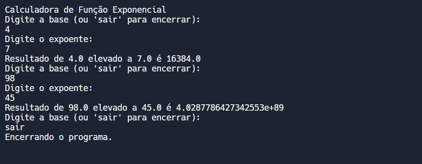

# FUNCAO EXPONENCIAL
👨‍🏫CALCULADORA DE FUNÇÃO EXPONENCIAL SIMPLES IMPLEMENTADA EM SWIFT.

 <br>

## DESCRIÇÃO:
Este projeto é uma calculadora de função exponencial simples implementada em Swift. O programa permite que o usuário calcule a potência de um número (base) elevado a outro número (expoente), garantindo que as entradas fornecidas sejam válidas. O programa é interativo e é executado no terminal.

## FUNCIONALIDADES:
1. **Cálculo de Potência**:
   - Permite ao usuário calcular a potência \( a^b \), onde \( a \) é a base e \( b \) é o expoente.
   
2. **Validação de Entrada**:
   - Verifica se as entradas fornecidas pelo usuário são números válidos.
   - Solicita a entrada novamente se uma entrada inválida for fornecida.

3. **Interatividade**:
   - Oferece um menu interativo onde o usuário pode inserir os valores da base e do expoente.
   - Permite ao usuário encerrar o programa digitando "sair".

## COMO USAR?
1. **Execução do Programa**:
   - Abra o terminal.
   - Navegue até o diretório `./CODIGO`.
   - Execute o comando:
   ```sh
   swift main.swift
   ```
   
2. **Menu de Entrada**:
   - Ao iniciar o programa, uma mensagem de boas-vindas é exibida.
   - O programa solicita ao usuário que insira a base. Se o usuário deseja encerrar o programa, pode digitar "sair".
   
3. **Entrada de Dados**:
   - Após inserir a base, o programa solicita ao usuário que insira o expoente.
   - As entradas são validadas para garantir que sejam números válidos.
   - Se uma entrada inválida for fornecida, o programa exibirá uma mensagem de erro e solicitará a entrada novamente.
   
4. **Cálculo e Resultado**:
   - O programa calcula a potência usando a função `pow` e exibe o resultado no console.
   
5. **Repetição ou Encerramento**:
   - Após exibir o resultado, o programa solicita novamente a base e o expoente, permitindo ao usuário realizar novos cálculos.
   - O usuário pode encerrar o programa a qualquer momento digitando "sair" quando solicitado para a entrada da base.

## NÃO SABE?
- Entendemos que para manipular arquivos em muitas linguagens e tecnologias, é necessário possuir conhecimento nessas áreas. Para auxiliar nesse aprendizado, oferecemos cursos gratuitos disponíveis:
* [CURSO DE SWIFT](https://github.com/VILHALVA/CURSO-DE-SWIFT)
* [CONFIRA MAIS CURSOS](https://github.com/VILHALVA?tab=repositories&q=+topic:CURSO)

## CREDITOS:
- [PROJETO CRIADO PELO VILHALVA](https://github.com/VILHALVA)


